# Churn Modeling with scikit-learn
This repository accompanies the [Visual Model Interpretability for Telco Churn](https://blog.cloudera.com/visual-model-interpretability-for-telco-churn-in-cloudera-data-science-workbench/) blog post and contains the code needed to build all project artifacts on CML. Additionally, this project serves as a working example of the concepts discussed in the Cloudera Fast Forward report on [Interpretability](https://ff06-2020.fastforwardlabs.com/) which is freely available for download.


The primary goal of this repo is to build a logistic regression classification model to predict the probability that a group of customers will churn from a fictitious telecommunications company. In addition, the model is interpreted using a technique called [Local Interpretable Model-agnostic Explanations (LIME)](https://github.com/marcotcr/lime). Both the logistic regression and LIME models are deployed using CML's real-time model deployment capability and exercised via a basic Flask-based web application that allows users to interact with the model to see which factors in the data have the most influence on the probability of a customer churning.

## Project Structure

The project is organized with the following folder structure:

```
.
├── code/              # Backend scripts, and notebooks needed to create project artifacts
├── flask/             # Assets needed to support the front end application
├── images/            # A collection of images referenced in project docs
├── models/            # Directory to hold trained models
├── raw/               # The raw data file used within the project
├── cdsw-build.sh      # Shell script used to build environment for experiments and models
├── model_metrics.db   # SQL lite database used to store model drift metrics
├── README.md
└── requirements.txt
```

By following the notebooks, scripts, and documentation in the `code` directory, you will understand how to perform similar classification tasks on CML, as well as how to use the platform's major features to your advantage. These features include:

- Data ingestion and manipulation with Spark
- Streamlined model development and experimentation
- Point-and-click model deployment to a RESTful API endpoint
- Application hosting for deploying frontend ML applications
- Model operations including model governance and tracking of mode performance metrics

We will focus our attention on working within CML, using all it has to offer, while glossing over the details that are simply standard data science. We trust that you are familiar with typical data science workflows and do not need detailed explanations of the code.

If you have deployed this project as an Applied ML Prototype (AMP), you will not need to run any of the setup steps outlined [in this document](code/README.md) as everything is already installed for you. However, you may still find it instructive to review the documentation and their corresponding files, and in particular run through `code/2_data_exploration.ipynb` and `code/3_model_building.ipynb` in a Jupyter Notebook session to see the process that informed the creation of the final model.

If you are building this project from source code without automatic execution of project setup, then you should follow the steps listed [in this document](code/README.md) carefully and in order.

## Lab 1: Log in and Project Setup

### Login into the CDP tenant

You have been given a user name and password and a url to the CDP tenant in the chat.
When you enter the url in your browser you get following login page, where you now enter
your given user name and password


In case of success you should get to this home page of the CDP tenant:
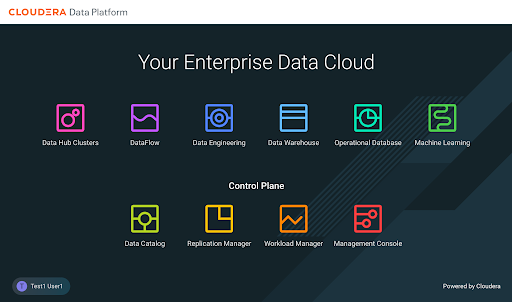


### Initialize the Project
AMPs (Applied Machine Learning Prototypes) are reference Machine Learning projects that have been built by Cloudera Fast Forward Labs to provide quickstart examples and tutorials. AMPs are deployed into the Cloudera Machine Learning (CML) experience, which is a platform you can also build your own Machine Learning use cases on.

- Go to the Workshop CDP Tenant
- Navigate to the Machine Learning tile from the CDP Menu.
- Click into the Workspace by clicking the Workspace name.


A Workspace is a cluster that runs on a kubernetes service to provide teams of data scientists a platform to develop, test, train, and ultimately deploy machine learning models. It is designed to deploy a small number of infra resources and then autoscale compute resources as needed when end users implement more workloads and use cases.

- Click on *User Settings* in the left panel
- Go to Environment Variables tab and set your WORKLOAD_PASSWORD (this is the same as your login password for your User0xx ).


In a workspace, Projects view is the default and you’ll be presented with all public (within your organization) and your own projects, if any. In this lab we will be creating a project based on Applied ML Prototype.

- Click on *AMPs* in the side panel and search for “workshop”

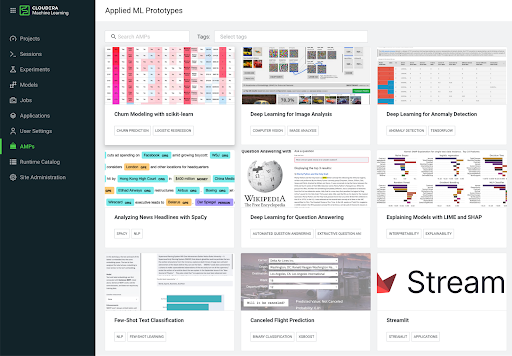

- Click on the AMP card and then on *Configure Project*


**IMPORTANT!**
In the Configure Project screen, change the HIVE_TABLE to have a unique suffix. Leave the other environment variables as is.


| variable | value |
| ----------- | ----------- |
| DATA_LOCATION | data/churn_prototype |
| HIVE_DATABASE | data/default |
| HIVE_TABLE | churn_protype_YOUR UNIQUE VALUE |


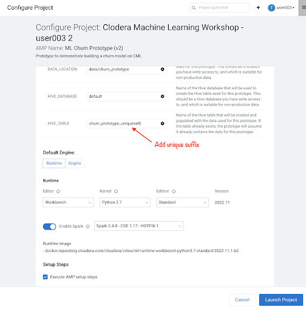


- Click *Launch Project*

## Lab 2: Data Loading and interactive Analysis (20 min)

### 1 Ingest Data
This script will read in the data csv from the file uploaded to the object store (s3/adls) setup
during the bootstrap and create a managed table in Hive. This is all done using Spark.

Open `1_data_ingest.py` in a Workbench session: python3, 1 CPU, 2 GB. Run the file.

Sessions allow you to perform actions such as run R, Scala or Python code. They also provide access to an interactive command prompt and terminal. Sessions will be built on a specified Runtime Image, which is a docker container that is deployed onto the ML Workspace. In addition you can specify how much compute you want the session to use.

- Click on *Overview* in the side panel
- Click *New Session* in the top right corner

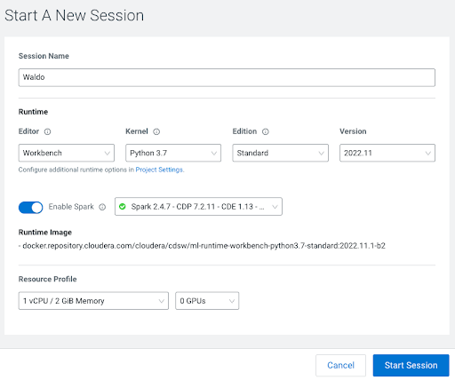

Before you start a new session you can give it a name, choose an editor (e.g. JupyterLab), what kernel you’d like to use (e.g. latest Python or R), whether you want to make Spark (and hdfs) libraries be available in your session, and finally the resource profile (CPU, memory, and GPU).
- Ensure that Spark is enabled
- Leave all other settings as is and click *start session*
The Workbench is now starting up and deploying a container onto the workspace at this point. Going from left to right you will see the project files, editor pane, and session pane.

Once you see the flashing red line on the bottom of the session pane turn steady green the container has been successfully started.

You will be greeted with a pop-up window to get you started connecting to pre-populated Data Lake sources (e.g. virtual Data Warehouses). You could simply copy the code snippet provided and easily connect to, say, a Hive vDW. However, in this lab we won’t be using this feature.

Script 1: Ingest Data

Navigate to code/1_data_ingest.py

In this script you will ingest a raw csv file into a Spark Dataframe. The script has a .py extension and therefore is ideally suited for execution with the Workbench editor. No modifications to the code are required and it can be executed as is.

You can execute the entire script in bulk by clicking on the “play icon” on the top menu bar. Once you do this you should notice the editor bar switches from green to red.
As an alternative you can select subsets of the code and execute those only. This is great for troubleshooting and testing. To do so, highlight a number of lines of code from your script and then click on “Run” -> “Run Lines” from the top menu bar.

Important! Run All lines in this script

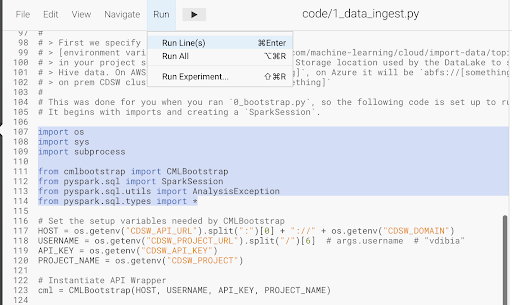

The code is explained in the script comments. However, here are a key few highlights:

- Because CML is integrated with SDX and CDP, you can easily retrieve large datasets from Cloud Storage (ADLS, S3, Ozone) with a simple line of code
- Apache Spark is a general purpose framework for distributed computing that offers high performance for both batch and stream processing. It exposes APIs for Java, Python, R, and Scala, as well as an interactive shell for you to run jobs.
- In Cloudera Machine Learning (CML), Spark and its dependencies are bundled directly into the CML runtime Docker image.
Furthermore, you can switch between different Spark versions at Session launch.


In a real-life scenario, the underlying data may be shifting from week to week or even hour to hour. It may be necessary to run the ingestion process in CML on a recurring basis. Jobs allow any project script to be scheduled to run inside of an ML Workspace compute cluster.

- Click on  *Project* in the top panel
- Click on  *Jobs* in the side panel
- Click *New Job*
- Give your job a name (e.g. Ingestion Job) and select code/1_data_ingest.py as the Script to run
- Toggle *Enable Spark*
- Select Recurring as the Schedule from the dropdown and provide daily time for the job to run

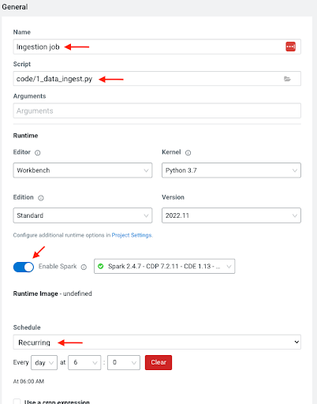


- Scroll to the bottom of the page and click *Create Job*


Optionally, you can also manually trigger your job by clicking the *Run*   action button on the right.
With Jobs you can schedule and orchestrate your batch scripts. Jobs allow you to build complex pipelines and are an essential part of any CI/CD or ML Ops pipeline. Typical use cases span from Spark ETL, Model Batch Scoring, A/B Testing and other model management related automations.
Click on *Sessions*  in the side panel to return to your running session


### 2 Interactive Analysis with JupyterLab

In the previous section you loaded a csv file with a python script. In this section you will perform more Python commands with Jupyter Notebooks. Notebooks have a “.ipynb” extension and need to be executed with a Session using the JupyterLabs editor.

Launch a new session by selecting the three “vertical dots” on the right side of the top menu bar. If you are in full-screen mode, the *Sessions*  dropdown will appear without having to click into the menu.

Launch the new Session with the following settings:

- Session Name: telco_churn_session_2
- Editor: *JupyterLab*
- Kernel: Python 3.7
- Resource Profile: 1vCPU/2 GiB Memory
- Runtime Edition: Standard
- Runtime Version: Any available version
- Enable Spark Add On: enable any Spark version *Enable Spark*

After a few moments the JupyterLab editor should have taken over the screen.

Open Notebook *code/2_data_exploration.ipynb* from the left side menu and investigate the code.

Notebook cells are meant to be executed individually and give a more interactive flavor for coding and experimentation.

As before, no code changes are required and more detailed instructions are included in the comments. There are two ways to run each cell. Click on the cell you want to run. Hit “Shift” + “Enter” on your keyboard. Use this approach if you want to execute each cell individually. If you use this approach, make sure to run cells top to bottom, as they depend on each other.

Alternatively, open the “Run” menu from the top bar and then select “Run All”. Use this approach if you want to execute the entire notebook in bulk.

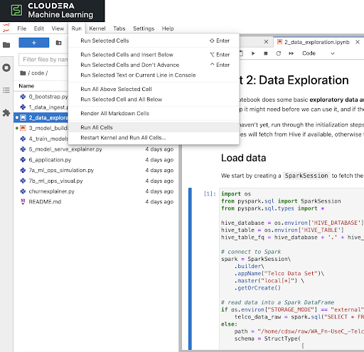


With CML Runtimes, you can easily switch between different editors and work with multiple editors or programming environments in parallel if needed.  First you stored a Spark Dataframe as a Spark table in the “1_ingest_data.py” python script using the Workbench editor. Then you retrieved the data in notebook “2_data_exploration.ipynb” using a JupyterLab session via Spark SQL. Spark SQL allows you to easily exchange files across sessions. Your Spark table was tracked as Hive External Tables and automatically made available in Atlas, the Data Catalog, and CDW. This is powered by SDX integration and requires no work on the CDP Admin or Users. We will see more on this in Part 7.

## Lab 3: Model Training and mlflow experiments (20 min)

When you are finished with notebook “2_data_exploration.ipynb” go ahead and move on to notebook “3_model_building.ipynb”. As before, no code changes are required.

- While still in JupyterLab session,
- navigate to code/3_model_building.ipynb
- Execute all code in 3_model_building.ipynb

In this notebook “3_model_building.ipynb” you create a model with SciKit Learn and Lime, and then store it in your project. Optionally, you could have saved it to Cloud Storage. CML allows you to work with any other libraries of your choice. This is the power of CML… any open source library and framework is one pip install away.

- Click *Stop* to terminate your JupyterLab session
- Return to *<- Project*  and *Sessions*   and to your single running session

### Model training and mlflow Experiments

After exploring the data and building an initial, baseline model the work of optimization (a.k.a. hyperparameter tuning) can start to take place. In this phase of an ML project, model training script is made to be more robust. Further, it is now time to find model parameters that provide the “best” outcome. Depending on the model type and business use case “best” may mean use of different metrics. For instance, in a model that is built to diagnose ailments, the rate of false negatives may be especially important to determine “best” model. In cybersecurity use case, it may be the rate of false positives that’s of most interest.

To give Data Scientists flexibility to collect, record, and compare experiment runs, CML provides out-of-the-box mlflow Experiments as a framework to achieve this.

- Inside a running Workbench session,
- navigate to code/4_train_model.py
- Click the *play button* in the top menu

This script uses “kernel” and “max_iter” as the two parameters to manipulate during model training in order to achieve the best result. In our case, we’ll define “best” as the highest “test_score”.

- While your script is running,
- click on *<- Project* in the top panel
- Click on *Experiments*  in the side bar
- Click on Churn Model Tuning

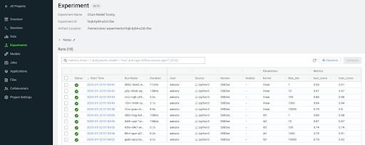


As expected, higher number of max_iterations produces better result (higher test_score). Interestingly, the choice of kernel does not make a difference at higher max_iter values. We can choose linear as it allows for faster model training.

- Select all runs with “linear” Kernel
- Click *Compare*
- Click the metric *test_score*

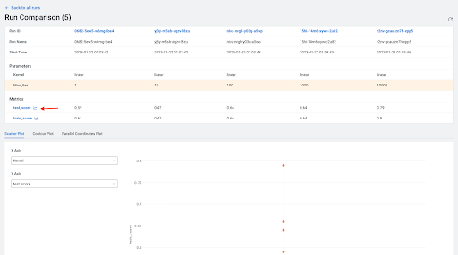


Built-in visualizations in mlflow allow for more detailed comparison of various experiment runs and outcomes.


## Lab 4: Model Deployment (20 min)

Once a model is trained its predictions and insights must be put to use so they can add value to the organization. Generally this means using the model on new, unseen data in a production environment that offers key ML Ops capabilities.

One such example is Batch Scoring via CML Jobs. The model is loaded in a script and the predict function provided by the ML framework is applied to data in batch. The script is scheduled and orchestrated to perform the scoring on a regular basis. In case of failures, the script or data are manually updated so the scoring can resume.

This pattern is simple and reliable but has one pitfall. It requires the user or system waiting for the scoring job to run at its scheduled time. What if predictions are required on a short notice? Perhaps when a prospect navigates on an online shopping website or a potential anomaly is flagged by a third party business system?

- CML Models allow you to deploy the same model script and model file in a REST Endpoint so the model can now serve responses in real time. The endpoint is hosted by a container.
- CML Models provides tracking, metadata and versioning features that allow you to manage models in production.
- Similarly, CML Applications allows you to deploy visual tools in an endpoint container. This is typically used to host apps with open source libraries such as Flask, Shiny, Streamlit and more.
- Once a model is deployed to a CML Models container, a CML Application can forward requests to the Model endpoint to provide visual insights powered by ML models.

### Lets Deploy a scoring model

Below are the steps to deploy a near-real-time scoring model:

- Click on *Models*  in the side panel
- Click *New Model*
- **Important!** Name your model *Churn Model API Endpoint* .
Any other name will cause issues with downstream scripts.
- **Important!** Uncheck *Enable Authentication*
- Under File select *code/5_model_serve_explainer.py*
- Under Function enter *explain*
- For Example Input enter the following JSON
- You do not need to Enable Spark for model serving in this case

This JSON is a set of key value pairs representing a customer’s attributes. For example, a customer who is currently on a DSL Internet Service plan.

```
{
  "StreamingTV": "No",
  "MonthlyCharges": 70.35,
  "PhoneService": "No",
  "PaperlessBilling": "No",
  "Partner": "No",
  "OnlineBackup": "No",
  "gender": "Female",
  "Contract": "Month-to-month",
  "TotalCharges": 1397.475,
  "StreamingMovies": "No",
  "DeviceProtection": "No",
  "PaymentMethod": "Bank transfer (automatic)",
  "tenure": 29,
  "Dependents": "No",
  "OnlineSecurity": "No",
  "MultipleLines": "No",
  "InternetService": "DSL",
  "SeniorCitizen": "No",
  "TechSupport": "No"
}
```

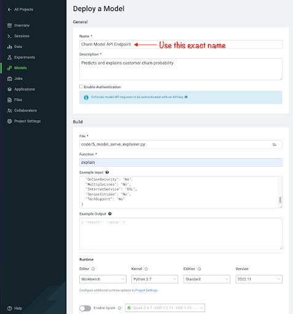

- Scroll to the bottom of the page and click *Deploy Model*


Model deployment may take a minute or two, meanwhile you can click on the Model name and explore the UI. The code for a sample request is provided on the left side. On the right side observe the model’s metadata. Each model is assigned a number of attributes including Model Name, Deployment, Build and creation timestamp.


- Note down the *Build Id* of your model, we will need it in MLOps part of the workshops

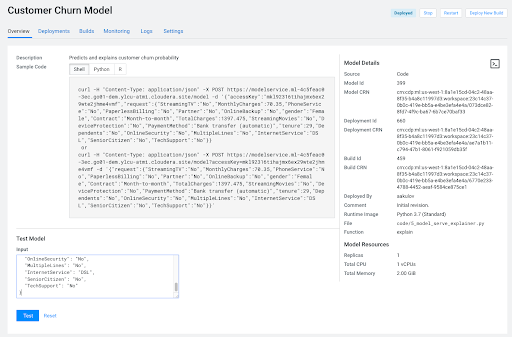


- Once your model is Deployed, click *Test*

The test simulates a request submission to the Model endpoint. The model processes the input and returns the output along with metadata and a prediction for the customer. In addition, the request is assigned a unique identifier. We will use this metadata for ML Ops later in part 6.  


### Lets simulate some real-world model performance for later purposes

Before moving on to the next section, we will kick off a script to simulate real-world model performance.

- Return to a running session () or start a new session if none are running
- Navigate to code/7a_ml_ops_simulation.py
- Run the entire script by clicking  in the top menu

This will generate a 1000 calls to the model, while we explore other parts of CML. **Do not** wait for this script to finish. Proceed to the next part of the workshop.

### Lets look into what we just deployed

Navigate back to the Project Overview page and open the *“5_model_serve_explainer.py”* script. Scroll down and familiarize yourself with the code.

- Notice the method “explain” method. This is the Python function whose purpose is to receive the Json input as a request and return a Json output as a response.
Within the method, the classifier object is used to apply the model object’s predict method.
- In addition, notice that a decorator named “@cdsw.model_metrics” is applied to the “explain” method. Thanks to the decorator you can use the “cdsw.track_metric” methods inside the “explain” method to register each scalar value associated with each request.
- The values are saved in the Model Metrics Store, a built in database used for tracking model requests.

Navigate back to the Project Overview page. Open the “models/telco_linear” subfolder and notice the presence of the “telco_linear.pkl” file. This is the physical model file loaded by the .py script you just inspected above.


## Lab 5: Interacting with the visual application (10 min)

## Lab 6: CML Model Operations (15 min)

## Lab 7: Model Lineage Tracking (20 min)
