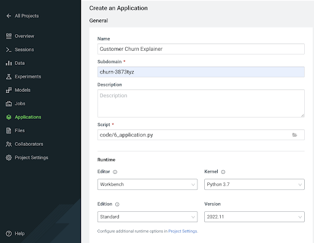
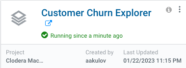
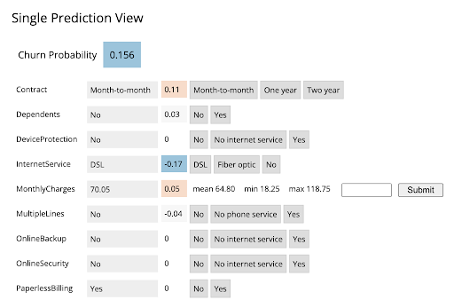
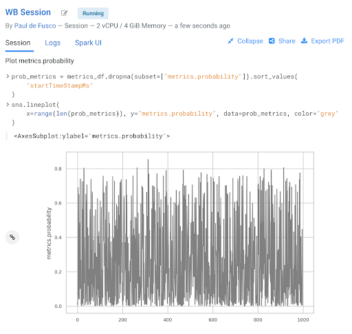
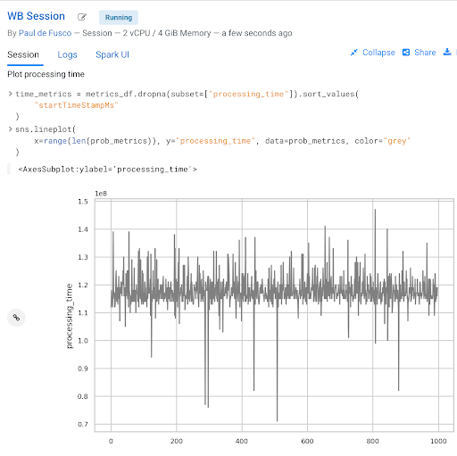
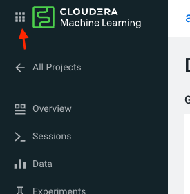
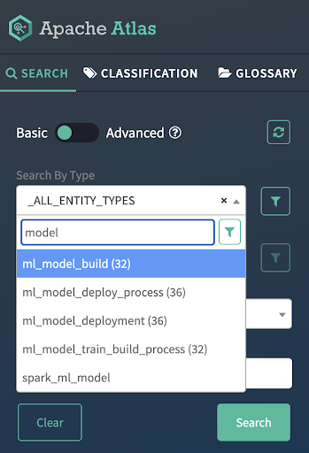
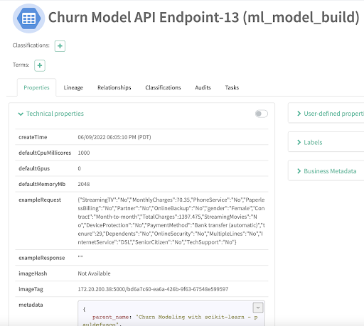
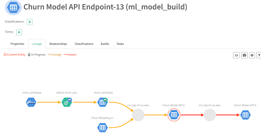

# Churn Modeling with scikit-learn
This repository accompanies the [Visual Model Interpretability for Telco Churn](https://blog.cloudera.com/visual-model-interpretability-for-telco-churn-in-cloudera-data-science-workbench/) blog post and contains the code needed to build all project artifacts on CML. Additionally, this project serves as a working example of the concepts discussed in the Cloudera Fast Forward report on [Interpretability](https://ff06-2020.fastforwardlabs.com/) which is freely available for download.


The primary goal of this repo is to build a logistic regression classification model to predict the probability that a group of customers will churn from a fictitious telecommunications company. In addition, the model is interpreted using a technique called [Local Interpretable Model-agnostic Explanations (LIME)](https://github.com/marcotcr/lime). Both the logistic regression and LIME models are deployed using CML's real-time model deployment capability and exercised via a basic Flask-based web application that allows users to interact with the model to see which factors in the data have the most influence on the probability of a customer churning.

## Project Structure

The project is organized with the following folder structure:

```
.
├── code/              # Backend scripts, and notebooks needed to create project artifacts
├── flask/             # Assets needed to support the front end application
├── images/            # A collection of images referenced in project docs
├── models/            # Directory to hold trained models
├── raw/               # The raw data file used within the project
├── cdsw-build.sh      # Shell script used to build environment for experiments and models
├── model_metrics.db   # SQL lite database used to store model drift metrics
├── README.md
└── requirements.txt
```

By following the notebooks, scripts, and documentation in the `code` directory, you will understand how to perform similar classification tasks on CML, as well as how to use the platform's major features to your advantage. These features include:

- Data ingestion and manipulation with Spark
- Streamlined model development and experimentation
- Point-and-click model deployment to a RESTful API endpoint
- Application hosting for deploying frontend ML applications
- Model operations including model governance and tracking of mode performance metrics

We will focus our attention on working within CML, using all it has to offer, while glossing over the details that are simply standard data science. We trust that you are familiar with typical data science workflows and do not need detailed explanations of the code.

## Lab 1: Log in and Project Setup

#### Login into the CDP tenant

You have been given a user name and password and a url to the CDP tenant in the chat.
When you enter the url in your browser you get following login page, where you now enter
your given user name and password


In case of success you should get to this home page of the CDP tenant:


#### Initialize the Project
AMPs (Applied Machine Learning Prototypes) are reference Machine Learning projects that have been built by Cloudera Fast Forward Labs to provide quickstart examples and tutorials. AMPs are deployed into the Cloudera Machine Learning (CML) experience, which is a platform you can also build your own Machine Learning use cases on.

- Go to the Workshop CDP Tenant
- Navigate to the Machine Learning tile from the CDP Menu.
- Click into the Workspace by clicking the Workspace name.


A Workspace is a cluster that runs on a kubernetes service to provide teams of data scientists a platform to develop, test, train, and ultimately deploy machine learning models. It is designed to deploy a small number of infra resources and then autoscale compute resources as needed when end users implement more workloads and use cases.

- Click on *User Settings* in the left panel
- Go to Environment Variables tab and set your WORKLOAD_PASSWORD (this is the same as your login password for your User0xx ).


In a workspace, Projects view is the default and you’ll be presented with all public (within your organization) and your own projects, if any. In this lab we will be creating a project based on Applied ML Prototype.

- Click on *AMPs* in the side panel and search for “workshop”


- Click on the AMP card and then on *Configure Project*


**IMPORTANT!**
In the Configure Project screen, change the HIVE_TABLE to have a unique suffix. Leave the other environment variables as is.


| variable | value |
| ----------- | ----------- |
| DATA_LOCATION | my-data/churn_prototype |
| HIVE_DATABASE | default |
| HIVE_TABLE | churn_protype_YOUR UNIQUE VALUE |
 
<br/>

 
 <br/>
- Click *Launch Project*

 <br/><br/> 

## Lab 2: Data Loading and interactive Analysis (20 min)

#### Data Loading

Sessions allow you to perform actions such as run R, Scala or Python code. They also provide access to an interactive command prompt and terminal. Sessions will be built on a specified Runtime Image, which is a docker container that is deployed onto the ML Workspace. In addition you can specify how much compute you want the session to use.

- Click on *Overview* in the side panel
- Click *New Session* in the top right corner
<br/>

<br/>


Before you start a new session you can give it a name, choose an editor (e.g. JupyterLab), what kernel you’d like to use (e.g. latest Python or R), whether you want to make Spark (and hdfs) libraries be available in your session, and finally the resource profile (CPU, memory, and GPU).
- Ensure that Spark is enabled
- Leave all other settings as is and click *start session*
<br/>
The Workbench is now starting up and deploying a container onto the workspace at this point. Going from left to right you will see the project files, editor pane, and session pane.

Once you see the flashing red line on the bottom of the session pane turn steady green the container has been successfully started.

You will be greeted with a pop-up window to get you started connecting to pre-populated Data Lake sources (e.g. virtual Data Warehouses). You could simply copy the code snippet provided and easily connect to, say, a Hive vDW. However, in this lab we won’t be using this feature.

**Script 1: Ingest Data**

- Navigate to code/1_data_ingest.py

In this script you will ingest a raw csv file into a Spark Dataframe. The script has a .py extension and therefore is ideally suited for execution with the Workbench editor. No modifications to the code are required and it can be executed as is.

You can execute the entire script in bulk by clicking on the “play icon” on the top menu bar. Once you do this you should notice the editor bar switches from green to red.
As an alternative you can select subsets of the code and execute those only. This is great for troubleshooting and testing. To do so, highlight a number of lines of code from your script and then click on “Run” -> “Run Lines” from the top menu bar.

**Important! Run All lines in this script**

<br/>

<br/>


The code is explained in the script comments. However, here are a key few highlights:

- Because CML is integrated with SDX and CDP, you can easily retrieve large datasets from Cloud Storage (ADLS, S3, Ozone) with a simple line of code
- Apache Spark is a general purpose framework for distributed computing that offers high performance for both batch and stream processing. It exposes APIs for Java, Python, R, and Scala, as well as an interactive shell for you to run jobs.
- In Cloudera Machine Learning (CML), Spark and its dependencies are bundled directly into the CML runtime Docker image.
Furthermore, you can switch between different Spark versions at Session launch.


In a real-life scenario, the underlying data may be shifting from week to week or even hour to hour. It may be necessary to run the ingestion process in CML on a recurring basis. Jobs allow any project script to be scheduled to run inside of an ML Workspace compute cluster.

- Click on  *Project* in the top panel
- Click on  *Jobs* in the side panel
- Click *New Job*
- Give your job a name (e.g. Ingestion Job) and select code/1_data_ingest.py as the Script to run
- Toggle *Enable Spark*
- Select Recurring as the Schedule from the dropdown and provide daily time for the job to run

<br/>

<br/>

- Scroll to the bottom of the page and click *Create Job*

<br/>

<br/>

Optionally, you can also manually trigger your job by clicking the *Run*   action button on the right.
With Jobs you can schedule and orchestrate your batch scripts. Jobs allow you to build complex pipelines and are an essential part of any CI/CD or ML Ops pipeline. Typical use cases span from Spark ETL, Model Batch Scoring, A/B Testing and other model management related automations.

- Click on *Sessions*  in the side panel and on the *Session Name* to return to your running session

<br/>

<br/>


#### Interactive Analysis with JupyterLab

In the previous section you loaded a csv file with a python script. In this section you will perform more Python commands with Jupyter Notebooks. Notebooks have a “.ipynb” extension and need to be executed with a Session using the JupyterLabs editor.

Launch a new session by selecting *New Session* in the menu bar in the top right side of the screen. If you are in full-screen mode, the *Sessions*  dropdown will appear without having to click into the menu.

<br/>

<br/>

Launch the new Session with the following settings:

- Session Name: telco_churn_session_2
- **Important!** Editor: *JupyterLab*
- Kernel: Python 3.7
- Resource Profile: 1vCPU/2 GiB Memory
- Runtime Edition: Standard
- Runtime Version: Any available version
- Enable Spark Add On: enable any Spark version *Enable Spark*

<br/>

<br/>

After a few moments the JupyterLab editor should have taken over the screen.

Open Notebook *code/2_data_exploration.ipynb* from the left side menu and investigate the code.

Notebook cells are meant to be executed individually and give a more interactive flavor for coding and experimentation.

As before, no code changes are required and more detailed instructions are included in the comments. There are two ways to run each cell. Click on the cell you want to run. Hit “Shift” + “Enter” on your keyboard. Use this approach if you want to execute each cell individually. If you use this approach, make sure to run cells top to bottom, as they depend on each other.

Alternatively, open the “Run” menu from the top bar and then select “Run All”. Use this approach if you want to execute the entire notebook in bulk.

<br/>

<br/>

With CML Runtimes, you can easily switch between different editors and work with multiple editors or programming environments in parallel if needed.  First you stored a Spark Dataframe as a Spark table in the “1_ingest_data.py” python script using the Workbench editor. Then you retrieved the data in notebook “2_data_exploration.ipynb” using a JupyterLab session via Spark SQL. Spark SQL allows you to easily exchange files across sessions. Your Spark table was tracked as Hive External Tables and automatically made available in Atlas, the Data Catalog, and CDW. This is powered by SDX integration and requires no work on the CDP Admin or Users. We will see more on this in Part 7.

## Lab 3: Model Training and mlflow experiments (20 min)

When you are finished with notebook “2_data_exploration.ipynb” go ahead and move on to notebook “3_model_building.ipynb”. As before, no code changes are required.

- While still in JupyterLab session,
- navigate to code/3_model_building.ipynb
- Execute all code in 3_model_building.ipynb

In this notebook “3_model_building.ipynb” you create a model with SciKit Learn and Lime, and then store it in your project. Optionally, you could have saved it to Cloud Storage. CML allows you to work with any other libraries of your choice. This is the power of CML… any open source library and framework is one pip install away.

- Click *Stop* to terminate your JupyterLab session
- Return to *<- Project*  and *Sessions*   and to your single running session

#### Model training and mlflow Experiments

After exploring the data and building an initial, baseline model the work of optimization (a.k.a. hyperparameter tuning) can start to take place. In this phase of an ML project, model training script is made to be more robust. Further, it is now time to find model parameters that provide the “best” outcome. Depending on the model type and business use case “best” may mean use of different metrics. For instance, in a model that is built to diagnose ailments, the rate of false negatives may be especially important to determine “best” model. In cybersecurity use case, it may be the rate of false positives that’s of most interest.

To give Data Scientists flexibility to collect, record, and compare experiment runs, CML provides out-of-the-box mlflow Experiments as a framework to achieve this.

- Inside a running Workbench session,
- navigate to code/4_train_model.py
- Click the *play button* in the top menu

This script uses “kernel” and “max_iter” as the two parameters to manipulate during model training in order to achieve the best result. In our case, we’ll define “best” as the highest “test_score”.

- While your script is running,
- click on *<- Project* in the top panel
- Click on *Experiments*  in the side bar
- Click on Churn Model Tuning

<br/>

<br/>

As expected, higher number of max_iterations produces better result (higher test_score). Interestingly, the choice of kernel does not make a difference at higher max_iter values. We can choose linear as it allows for faster model training.

- Select all runs with “linear” Kernel
- Click *Compare*
- Click the metric *test_score*

<br/>

<br/>


Built-in visualizations in mlflow allow for more detailed comparison of various experiment runs and outcomes.


## Lab 4: Model Deployment (20 min)

Once a model is trained its predictions and insights must be put to use so they can add value to the organization. Generally this means using the model on new, unseen data in a production environment that offers key ML Ops capabilities.

One such example is Batch Scoring via CML Jobs. The model is loaded in a script and the predict function provided by the ML framework is applied to data in batch. The script is scheduled and orchestrated to perform the scoring on a regular basis. In case of failures, the script or data are manually updated so the scoring can resume.

This pattern is simple and reliable but has one pitfall. It requires the user or system waiting for the scoring job to run at its scheduled time. What if predictions are required on a short notice? Perhaps when a prospect navigates on an online shopping website or a potential anomaly is flagged by a third party business system?

- CML Models allow you to deploy the same model script and model file in a REST Endpoint so the model can now serve responses in real time. The endpoint is hosted by a container.
- CML Models provides tracking, metadata and versioning features that allow you to manage models in production.
- Similarly, CML Applications allows you to deploy visual tools in an endpoint container. This is typically used to host apps with open source libraries such as Flask, Shiny, Streamlit and more.
- Once a model is deployed to a CML Models container, a CML Application can forward requests to the Model endpoint to provide visual insights powered by ML models.

#### Lets Deploy a scoring model

Below are the steps to deploy a near-real-time scoring model:

- Click on *Models*  in the side panel
- Click *New Model*
- **Important!** Name your model *Churn Model API Endpoint* .
Any other name will cause issues with downstream scripts.
- **Important!** Uncheck *Enable Authentication*
- Under File select *code/5_model_serve_explainer.py*
- Under Function enter *explain*
- For Example Input enter the following JSON
- You do not need to Enable Spark for model serving in this case

This JSON is a set of key value pairs representing a customer’s attributes. For example, a customer who is currently on a DSL Internet Service plan.

```
{
  "StreamingTV": "No",
  "MonthlyCharges": 70.35,
  "PhoneService": "No",
  "PaperlessBilling": "No",
  "Partner": "No",
  "OnlineBackup": "No",
  "gender": "Female",
  "Contract": "Month-to-month",
  "TotalCharges": 1397.475,
  "StreamingMovies": "No",
  "DeviceProtection": "No",
  "PaymentMethod": "Bank transfer (automatic)",
  "tenure": 29,
  "Dependents": "No",
  "OnlineSecurity": "No",
  "MultipleLines": "No",
  "InternetService": "DSL",
  "SeniorCitizen": "No",
  "TechSupport": "No"
}
```

<br/>

<br/>

- Scroll to the bottom of the page and click *Deploy Model*


Model deployment may take a minute or two, meanwhile you can click on the Model name and explore the UI. The code for a sample request is provided on the left side. On the right side observe the model’s metadata. Each model is assigned a number of attributes including Model Name, Deployment, Build and creation timestamp.


- Note down the *Build Id* of your model, we will need it in MLOps part of the workshops

<br/>

<br/>


- Once your model is Deployed, click *Test*

The test simulates a request submission to the Model endpoint. The model processes the input and returns the output along with metadata and a prediction for the customer. In addition, the request is assigned a unique identifier. We will use this metadata for ML Ops later in part 6.  


#### Lets simulate some real-world model performance for later purposes

Before moving on to the next section, we will kick off a script to simulate real-world model performance.

- Return to a running session () or start a new session if none are running
- Navigate to code/7a_ml_ops_simulation.py
- Run the entire script by clicking  in the top menu

This will generate a 1000 calls to the model, while we explore other parts of CML. **Do not** wait for this script to finish. Proceed to the next part of the workshop.

#### Lets look into what we just deployed

Navigate back to the Project Overview page and open the *“5_model_serve_explainer.py”* script. Scroll down and familiarize yourself with the code.

- Notice the method “explain” method. This is the Python function whose purpose is to receive the Json input as a request and return a Json output as a response.
Within the method, the classifier object is used to apply the model object’s predict method.
- In addition, notice that a decorator named “@cdsw.model_metrics” is applied to the “explain” method. Thanks to the decorator you can use the “cdsw.track_metric” methods inside the “explain” method to register each scalar value associated with each request.
- The values are saved in the Model Metrics Store, a built in database used for tracking model requests.

Navigate back to the Project Overview page. Open the “models/telco_linear” subfolder and notice the presence of the “telco_linear.pkl” file. This is the physical model file loaded by the .py script you just inspected above.

<br/>

<br/>


## Lab 5: Interacting with the visual application (10 min)


You have already seen that Cloudera Data Visualization is deployed in CML as an Application. In fact, any custom, UI app can be hosted within CML. These can be streamlit, Django, or Rshiny (or other frameworks) apps that deliver custom visualization or incorporate a real-time model scoring.

In the following steps we will deploy an Application for the Churn Customer project:

- Go to *Models* and click on the model that you’ve deployed
- Go to the *Settings* tab and copy the *Access Key* string


- Navigate to *Files > flask > single_view.html*
- **Important!** On line 61 of the file, update the access key value with the Access Key you got earlier.
- Click *File > Save (or ⌘+S)*
- Click on *Apllications*  in the side panel
- Click on *New Application*
- Give your application a name, and provide a **unique** subdomain
- Under *Scripts* select *code/6_application.py*
- Ensure that a *Workbench* editor is selected
- and *Enable Spark* toggle is turned on



- Scroll the bottom of the page and click *Create Application*  

Application startup can take up to 2 minutes, and once the application is ready you’ll see a card similar to this:




Click on the application in order to open it. This will automatically redirect you to the Visual Application landing page where the same data you worked with earlier is presented in an interactive table.

On the left side notice the probability column. This is the target variable predicted by the Machine Learning Model. It reflects the probability of each customer churning. The value is between 0 and 1. A value of 0.49 represents a 49% probability of the customer churning. By default, if the probability is higher than 50% the classifier will label the customer as “will churn” and otherwise as “will not churn”.

The 50% threshold can be increased or decreased implying customers previously assigned a “will churn” label may flip to “will not churn” and vice versa. This has important implications as it provides an avenue for tuning the level selectivity based on business considerations but a detailed explanation is beyond the scope of this content.

- Next, click on the customer at the top of the table to investigate further.


A more detailed view of the customer is automatically loaded. The customer has a 58% chance of churning.

The Lime model applied to the classifier provides a color coding scheme highlighting the most impactful features in the prediction label being applied to this specific customer.

For example, this customer’s prediction of “will churn” is more significantly influenced by the “Internet Service” feature.
- The dark red color coding signals that the customer is negatively impacted by the current value for the feature.
- The current values of Monthly Charges and Phone Service also increase the likelihood of churn while the values of the Streaming Movies and Total Charges features decrease the likelihood of churn.


Let’s see what happens if we change the value for the most impactful feature in this given scenario i.e. “Internet Service”. Currently the value is set to “Fiber Optic”.

- Hover over the entry in the table and select “DSL”.




The table has now reloaded and the churn probability for this customer has dramatically decreased to roughly 15%.

This simple analysis can help the marketer optimise strategy in accordance to different business objectives. For example, the company could now tailor a proactive marketing offer based on this precious information. In addition, a more thorough financial analysis could be tied to the above simulation perhaps after adjusting the 50% threshold to increase or decrease selectivity based on business constraints or customer lifetime value assigned to each customer.  


#### Script 6: Exploring the Application Script

- Navigate back to the CML Project Home folder.
- Open the “Code” folder and then script “6_application.py”.

This is a basic Flask application that serves the HTML and some specific data used for.

- Click on “Open in Workbench” to visualize the code in a more reader friendly-mode.


Now you will be able to explore the code with the Workbench Editor. The “Launch Session” form will automatically load on the right side of your screen. There is no need to launch a session so you can just minimize it.

As always no code changes are required. Here are some key highlights:

- At lines 177 - 191 we load the model and use the “Explain” method to load a small dataset in the file. This is similar to what you did in script 5. If you want to display more data or fast changing data there are other ways to do this, for example with Cloudera SQL Stream Builder.  
- At line 248 we run the app on the "CDSW_APP_PORT". This value is already preset for you as this is a default environment variable. You can reuse this port for other applications.


## Lab 6: CML Model Operations (15 min)

The following steps assume you have executed the* 7a_ml_ops_simulation.py* script as shown  in Lab 4. If you haven’t done it please go back and make sure to run the model simulation script.

- Navigate back to the project overview and launch a new session with the following configurations.

  - **Session Name: telco_churn_ops_session**
  - **Editor: Workbench**
  - **Kernel: Python 3.7**
  - **Resource Profile: 1vCPU/2 GiB Memory**
  - **Runtime Edition: Standard**
  - **Runtime Version: Any available version**
  - **Enable Spark Add On: any Spark version**

- Once the session is running, open script *7b_ml_ops_visual.py* and explore the code in the editor.
- Execute the whole script end to end without modifications.

Observe the code outputs on the right side. Here are the key highlights:

- Model predictions are tracked in the CML Models Metrics Store. This is enabled by the use of the Python decorator and the use of “cdsw.track_metrics” methods in script 5. What is being tracked is completely up to the script developer.
- You can then extract the predictions and related metadata and put the information in a Pandas dataframe. Again, the Python library you use does not matter and is entirely up to the developer.
- This is exactly what the first diagram on the right side of your screen shows. Each column represents a prediction request reaching your CML Model endpoint. Each row represents a metric you are tracking in the CML Models Metrics Store.


- Once the tracked metrics have been saved to a Python data structure they can be used for all sorts of purposes.
- For example, the second diagram shows a basic line plot in Seaborn where the models’ output probabilities are plotted as a function of time. On the X axis you can see the timestamp associated with each request. On the Y axis you can find the associated output probability.



- Similarly, you can plot processing time as shown in the third diagram. This represents the time duration required to process a particular request.
As an example, this information could be used to trigger the deployment of more resources to support this model endpoint when a particular threshold is passed. -  You can deploy more resources manually via the UI, or programmatically and in an automated CI/CD pipeline with CML APIv2 and CML Jobs.



- You can also monitor the model’s accuracy over time. For example, the below diagram shows a line plot of prediction accuracy sorted over time. As you can see, the trend is negative and the model is making increasingly less accurate predictions.
- Just like with processing time and other metrics, CML allows you to implement ML Ops pipelines that automate actions related to model management. For example, you could use a combination of CML Jobs and CML APIv2 to trigger the retraining and redeployment of a model when its accuracy reaches a particular threshold over a particular time period.
- As always this is a relatively basic example. CML is an open platform for hands-on developers which gives users the freedom to implement more complex ML Ops pipelines.


- Ground truth metrics can be collected with the cdsw.track_delayed_metrics method. This allows you to compare your predictions with the actual event after the prediction was output. In turn, this allows you to calculate the model accuracy and create visualizations such as the one above.
- For an example of the cdsw.track_delayed_metrics method open the “7a_ml_ops_simulation.py” script and review lines 249 - 269. Keep in mind that this is just a simulation.
- In a real world scenario the requests would be coming from an external system or be logged in a SQL or NoSQL database. In turn, the script above would be used to set  ground truth values in batch via a CML Job or in real time with a CML Model endpoint.


## Lab 7: Model Lineage Tracking (20 min)

**IMPORTANT! Make sure you are connected to VPN for this part of the workshop.**

This is needed to access Atlas inside of the CDP Data Lake.

CDP is an end-to-end hybrid enterprise data platform. Every user, workload, and dataset and  machine learning model can be governed from a central location via SDX, the Shared Data Experience.

Under the hood, SDX tracks and secures activity related to each CDP Data Service via “Hooks” and “Plugins”, including CML. If you want your models to be logged in SDX you have to add them to the lineage.yml file located in your project home folder.

- Click on *Overview*  and find *lineage.yml* file
- Click on the file to open


Take note of the metadata that is present here, including the source table name and the query used to create the training dataset. Additional metadata can be provided here.

- Click on the top left corner menu (Bento menu)



- Click on *Management Console*
- Click on the CDP environment you have been working in (where ML Workspace is deployed)
- Click on *Atlas* under QUICK LINKS


From the Atlas UI, search for ML models by entering the *ml_model_build* type. Notice that there are various Atlas entities to browse for models.




In the output, you will see all models that your colleagues deployed in this workshop. Notice that each model is assigned a unique ID at the end. That ID corresponds to the Model Build from CML. Identify your model using the Build Id noted down when you deployed your model. select the model you created.
Open your model by clicking its Model Name - Build Id.


Familiarize yourself with the Model properties tab. Notice that each model logged is associated with rich metadata. You can customize Atlas Model metadata by editing the lineage.yml file in the CML Project Home folder







Atlas and Ranger provides a rich set of Governance and Security capabilities. For example, you can apply Atlas tags to your entities across Data Services and then propagate Ranger policies to automatically secure applications across complex pipelines.

A detailed exploration of SDX in the context of CML is not in scope for this workshop but please visit the “Next Steps” section to find out more on this and other topics.


## Summary

In this workshop you created an end to end project to support a Machine Learning model in Production.

- You easily created a Spark Session and explored a large dataset with the PySpark library.
- ... were able to switch between editors, resources, and optionally Python and Spark versions at the click of a button.
- created a Model REST Endpoint to serve predictions to internal or external business applications.
- Then, you built an interactive dashboard to make the “black box model” interpretable for your business stakeholders.
- You explored the foundations of a basic ML Ops pipeline to easily retrain, monitor, and reproduce your model in production. With the CML Models interface you unit tested and increased model observability.
- Finally, you used CDP SDX to log and visualize Model Metadata and Lineage.

## Next Steps

If you want to learn more about CML and CDP we invite you to visit the following assets and tutorials or ask your Cloudera Workshop Lead for a follow up.
- [Learn how to use Cloudera Applied ML Prototypes](https://docs.cloudera.com/machine-learning/cloud/applied-ml-prototypes/topics/ml-amps-overview.html) to discover more CML Projects using MLFlow, Streamlit, Tensorflow, PyTorch and other popular libraries. The AMP Catalog is maintained by the Cloudera Fast Forward Labs team and allows you to automatically deploy complex use cases within minutes.
- [CML HowTo](https://github.com/pdefusco/CML_HowTo) : A series of tips and tricks for the CML beginner
- [Sentiment Analysis in R](https://github.com/pdefusco/simpsons_sentiment_analysis) : and end to end ML project with SparklyR and GPU training
- [CSA2CML](https://github.com/pdefusco/CSA2CML) : Build a real time anomaly detection dashboard with Flink, CML, and Streamlit
- [SDX2CML](https://github.com/pdefusco/SDX2CML) : Explore ML Governance and Security features in more detail to increase legal compliance and enhance ML Ops best practices.
- [CML2CDE](https://github.com/pdefusco/CML2CDE) : Create CI/CD Pipelines for Spark ETL with CML Notebooks and CDE Virtual Cluster
- [API v2](https://github.com/pdefusco/CML_AMP_APIv2) : Familiarize yourself with API v2, CML's goto Python Library for ML Ops and DevOps
- [Distributed PyTorch with Horovod](https://github.com/pdefusco/Distributed_PyTorch_Horovod) : A quickstart for distributing Horovod with the CML Workers API
